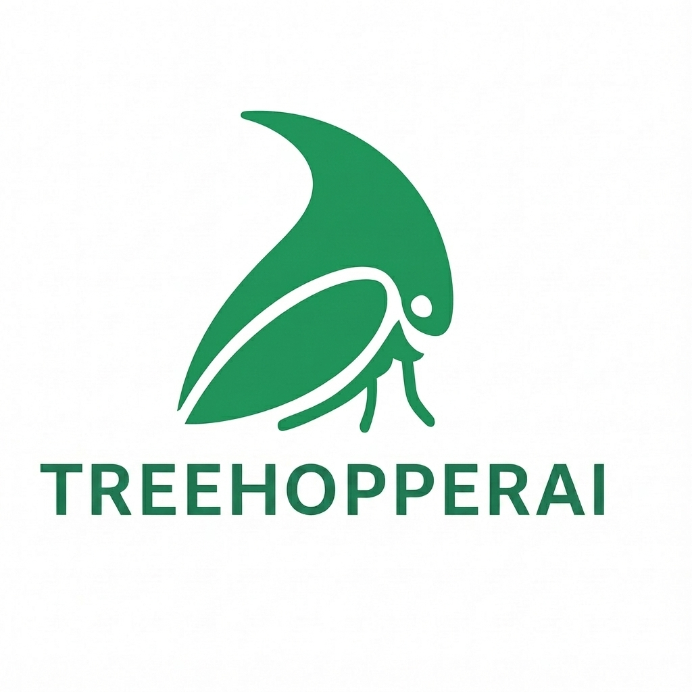

<div align="center">



### The Agent Builder & Orchestration Automation Runtime

**Create, chain, and orchestrate autonomous agents — locally, on edge devices, or in distributed fleets.**

[](https://www.python.org/)
[](https://fastapi.tiangolo.com/)
[](https://www.trychroma.com/)
[](#)
[](#)

</div>

---

##  What Is TreehopperAI?

**TreehopperAI** is an execution-detached runtime platform for agentic workflows that run reliably across edge, cloud, and on-prem environments — with native cancellation, resume, and observability..

### 🧭 What “Local-First” Means in TreehopperAI

TreehopperAI is local-first by design:

- All runtimes, chains, agents, logs, and state execute locally by default
- No cloud account is required to build or run workflows
- LLM providers are optional, pluggable dependencies
- Mock and offline modes are fully supported
- Cloud deployment is an opt-in convenience — not a requirement

You own the runtime. You choose where intelligence comes from.


```
th whatis


████████╗██████╗ ███████╗███████╗██╗  ██╗ ██████╗ ██████╗ ██████╗ ███████╗██████╗  █████╗ ██╗
╚══██╔══╝██╔══██╗██╔════╝██╔════╝██║  ██║██╔═══██╗██╔══██╗██╔══██╗██╔════╝██╔══██╗██╔══██╗██║
   ██║   ██████╔╝█████╗  █████╗  ███████║██║   ██║██████╔╝██████╔╝█████╗  ██████╔╝███████║██║
   ██║   ██╔══██╗██╔══╝  ██╔══╝  ██╔══██║██║   ██║██╔═══╝ ██╔═══╝ ██╔══╝  ██╔══██╗██╔══██║██║
   ██║   ██║  ██║███████╗███████╗██║  ██║╚██████╔╝██║     ██║     ███████╗██║  ██║██║  ██║██║
   ╚═╝   ╚═╝  ╚═╝╚══════╝╚══════╝╚═╝  ╚═╝ ╚═════╝ ╚═╝     ╚═╝     ╚══════╝╚═╝  ╚═╝╚═╝  ╚═╝╚═╝

                        TreehopperAI v0.1.0
            Think Globally. Compute Locally. Execute Intelligently.


TreehopperAI is a local-first, agentic workflow engine for building
and executing intelligent chains of AI agents.

Core Concepts
─────────────
Agent     → Single AI capability, also runs as a service
Chain     → Workflow of agents, also runs as a service
Runtime   → Long-lived execution
Run       → One execution
Detached  → Background, cancellable runs
Replay    → Late joiner visibility


```

##  Why This Project Matters

AI automation is rapidly becoming the backbone of modern software — yet the tooling around it remains fragmented, heavyweight, and increasingly centralized. Existing orchestrators either force developers into closed ecosystems, or bury simple ideas under layers of infrastructure complexity. Treehopper takes a different path. It brings AI orchestration back to where it belongs: *close to the developer*.

It brings together:

- ✔ Agent micro-apps
- ✔ Chain orchestration
- ✔ Multi-provider LLM calls
- ✔ Semantic memory
- ✔ Parallel execution
- ✔ Cancellation
- ✔ Edge-friendly deployment
- ✔ Portable FastAPI runtimes

###  Core Principles

| | |
|---|---|
| 🟦 **Lightweight** | Run on laptops, VMs, Raspberry Pis, or edge nodes — no GPUs required |
| 🟩 **Modular** | Every agent and chain becomes its own FastAPI micro-service |
| 🟧 **Developer-first** | Build and debug everything via CLI with predictable logs, pids, URLs, and registries |
| 🟥 **Deterministic** | Repeatable runs, structured history, and precise observability |
| 🟪 **Cloud-optional** | You own the compute. You choose the LLM provider. No lock-in |

> **TreehopperAI is a statement:**
> AI automation should be open, simple, transparent, and fully in the developer's control.

---

##  Why TreehopperAI?

| Feature | Description |
|---------|-------------|
| 🌱 **Local-first agent execution** | No cloud round-trips. No latency. No dependencies |
| 🔌 **Micro-app architecture** | Each agent becomes a standalone FastAPI micro-service with its own port |
| 🔄 **Chains = portable workflows** | Define multi-step flows with predictable inputs & outputs |
| 🧠 **Built-in memory** | Long-term semantic memory (ChromaDB) or ephemeral testing memory |
| ⚡ **Multi-LLM support** | Switch between OpenAI, Gemini, Perplexity, or local models seamlessly |
| 🧵 **Full orchestration core** | Parallel chains, throttling, cancellation, logging, history, safe cleanup |
| 🧩 **Edge deployment** | Package agents/chains to run on compute-limited devices |
| 🛠 **CLI for everything** | Build, lint, run, stop, inspect, clean, orchestrate |

---

## Who Is TreehopperAI For?

TreehopperAI is designed for:

- Backend & platform engineers building AI-powered workflows
- Developers deploying AI agents to edge devices or private infra
- Teams who want orchestration **without** vendor lock-in
- Startups prototyping AI automation quickly
- Enterprises experimenting with local-first AI systems

If you are tired of heavyweight orchestrators and want full control —
TreehopperAI is for you.

## Real-World Example Chains (Included)

Treehopper ships with realistic, production-inspired examples:

- **Manufacturing RCA Chain**
  - Image defect analysis
  - Equipment logs
  - Root cause identification
  - Automated dispatch

- **Finance Fraud Detection**
  - Risk scoring
  - Behavioral analysis
  - Composite decision routing

- **Bioinformatics Pipelines**
  - Data validation
  - Risk assessment
  - Report aggregation

These examples are runnable locally and serve as reference architectures.

## Security & Privacy

TreehopperAI runs **entirely on infrastructure you control**.

- No telemetry
- No hidden network calls
- No mandatory cloud dependencies

LLM providers are opt-in and configurable.

## Roadmap

- Agent & chain visualizer (minimal UI)
- Plugin system for custom runtimes
- More example chains (industry-specific)
- Optional metrics & observability adapters
- Community-contributed agent library


##  Quickstart

```bash
git clone <repo_url>
cd treehopper-core
pip install -e .

# Start main server
[treehopper / th] start --bg
```

**Open Swagger UI:**
[http://localhost:1567/docs](http://localhost:1567/docs)

---

##  Project Structure

```
treehopper-core/
├── treehopper/
│   ├── agents/                    # Built-in agents
│   ├── utils/                     # Utilities & run registry
│   ├── treehopper.py              # Agent runtime, registry, chaining
│   ├── treehopper_llm.py          # Multi-provider LLM abstraction
│   ├── treehopper_cli.py          # Main CLI entrypoint
│   ├── agent_runtime_app.py       # Agent micro-app runtime
│   ├── chain_runtime_app.py       # Chain micro-app runtime (detached mode)
│   ├── treehopper_chains.py       # Chain controller + parallel + cancellation
│   ├── treehopper_parallel.py     # Parallel execution engine
│   ├── treehopper_cancellation.py # Cancellation API (Phase 3.3)
│   ├── treehopper_cleaner.py      # Clean-up utility
|   ├── ..........
|   ├── agent_runtime_app.py       # To create the detached agent runtime
|   └── chain_runtime_app.py       # To create the detached chain runtime
|
├── examples/                      # Agent & chain usage
├── static/                        # Branding & assets
└── dashboard/                     # Optional UI
```

---

##  Agent Development

### Create a new agent

```bash
[treehopper / th] init weather
```

This generates:

```
weather/
├── handler.py   # Your business logic
└── schema.py    # Request/response models
```

### Implement agent

```python
# handler.py
from treehopper.treehopper import agent

@agent("greet", method="GET", goal="Greet the user")
async def greet(name: str = "Nitin"):
    return {"message": f"Hello, {name}!"}
```

Agent becomes available at:

```
GET /api/v1/agents/greet?name=Nitin
```

### Deploy to main server

```bash
[treehopper / th] build weather
[treehopper / th] run
```

---

##  Chaining Agents

```
th build chain <chain_name> <agentname> <agentname> ...
```

---

##  Multi-provider LLM Support

```python
await call_llm("What is edge AI?", provider="openai")
await call_llm("Explain solar energy", provider="gemini")
await call_llm("Compare wind vs hydro", provider="perplexity")
```

**Supported providers:**

- OpenAI (GPT-4o, GPT-4o-mini)
- Google Gemini Pro
- Perplexity (Mistral models)
- Local mock provider (for testing)

---

##  Chain Runtime (Detached Mode)

Detached mode launches a full FastAPI runtime per chain, ideal for:

- ✔ Cancellation
- ✔ Long-running workflows
- ✔ Persistent runtimes
- ✔ Parallel orchestrators
- ✔ Offline edge execution

### Run chain in detached mode

```bash
[treehopper / th] chain run my_chain --detached
```

Starts:

```
http://localhost:<auto_port>/api/v1/<chain>/run
```

### Run detached in background

```bash
[treehopper / th] chain run my_chain --detached --bg
```

### Stop it

```bash
[treehopper / th] chain stop my_chain
```

---

##  Parallel Execution (Phase 3.2)

Run a chain N times in parallel:

```bash
[treehopper / th] chain run my_chain --parallel 20 --concurrency 5
```

**Key points:**

- Parallelization occurs across chains, not inside a chain
- Throttle with `--concurrency` to avoid provider rate limits
- Each parallel run has its own run_id, history, results

---

##  Cancellation (Phase 3.3)

Treehopper supports cooperative async cancellation, similar to Temporal/Celery but at the agent-chain-runtime level.

> **Note:** Cancellation works ONLY in detached mode, because only detached mode provides true async task lifecycles.

### Cancellation & Resume Behavior (Hybrid - manual by default)

| Command | When it works | Notes / Examples |
|---|---|---|
| `[treehopper / th] chain cancel --run <run_id>` | Cancels a currently running execution **if** it is registered in the cancellation registry and task is active. | Works best for runs launched by `parallel` or long-running micro-apps. |
| `[treehopper / th] chain cancel --all <chain>` | Cancels all active runs for a chain (best-effort). | Cancels each known run_id under the chain. |
| `[treehopper / th] chain cancel-batch <batch_id>` | Cancels all runs in a parallel batch (best-effort). | Only works if runs are still active and registered in the batch registry. |
| `[treehopper / th] chain resume <run_id>` | Resume an unfinished/failed run (manual). | Default way to resume. Uses run history to skip completed steps. |
| Auto-resume (opt-in) | If `auto_resume=true` in `~/.treehopper/config.json`, main server will attempt to resume eligible runs on startup. | Auto-resume spawns background resume processes and will not override runs that are `cancelled` or `completed`. |

### 🟩 When cancellation actually works:
- **Active task registered**: The run was started and `run_with_cancellation.register_task` succeeded (common for long-running async runs or parallel runs).
- **Not yet finished**: The run is still in `ACTIVE_TASKS` registry. If task already finished, cancel reports "not found or already finished".
- **Detached micro-app**: cancellation is effective if micro-app registered the run and is still executing.
- **Limitations**: If the run already completed or the server crashed (task unregistered), `cancel` will not mark history as cancelled — use `resume` for recovery.


### 🟥 When Cancellation Won't Work

| Scenario | Supported? | Why |
|----------|------------|-----|
| Normal chain run (non-detached) | ❌ NO | Blocking HTTP call; no async context |
| `--parallel` without detached | ❌ NO | Each run is a synchronous client request |
| `--parallel --detached` | ❌ NO | All parallel calls target one blocking endpoint |
| CPU-bound agents | ❌ NO | Cannot be cancelled without async yield |

### 🟦 Cancel Commands

**Cancel by run_id:**

```bash
[treehopper / th] chain cancel --run <run_id>
```

**Cancel all active runs of a chain:**

```bash
[treehopper / th] chain cancel --all <chain>
```

**Cancel an entire batch:**

```bash
[treehopper / th] chain cancel-batch <batch_id>
```

---

##  Cleaning Up

```bash
[treehopper / th] clean
```

This command:

- Kills stuck uvicorn processes
- Removes pids/logs
- Resets registry (keeps subscription id)

---

##  Full CLI Reference

### Main Server

| Command | Description |
|---------|-------------|
| `[treehopper / th] run` | Start main server |
| `[treehopper / th] run --bg` | Start in background |
| `[treehopper / th] stop` | Stop main server |
| `[treehopper / th] restart` | Restart |
| `[treehopper / th] status` | Check health |

### Agents

| Command | Description |
|---------|-------------|
| `[treehopper / th] init <agent>` | Scaffold new agent |
| `[treehopper / th] lint <agent>` | Validate |
| `[treehopper / th] build <agent>` | Install into registry |
| `[treehopper / th] agent run <agent> --detached` | Start as micro-app |

### Chains

| Command | Description |
|---------|-------------|
| `[treehopper / th] chain build` | Create chain |
| `[treehopper / th] chain run` | Run chain |
| `[treehopper / th] chain stop` | Stop chain runtime |
| `[treehopper / th] chain logs` | Show last run |
| `[treehopper / th] chain cancel` | Cancel run(s) |
| `[treehopper / th] chain cancel-batch` | Cancel batch |

---

## Testing Strategy

Treehopper uses a layered testing approach:

- **Unit tests** (`pytest tests/unit`)
- **Integration tests** (`pytest tests/integration`)
- **Real E2E runtime smoke tests** (`scripts/e2e_smoke_treehopper_full.sh`)

E2E tests are intentionally shell-based and run the system exactly
as users do (CLI + detached runtimes). They are not written in pytest.

This ensures high confidence without coupling tests to internal
FastAPI or registry behavior.


##  License

**MIT License**

Treehopper is free for personal, commercial, edge, and enterprise usage.

---

##  Contributing

Pull requests, bug fixes, feature proposals, agent contributions, and ecosystem tools are welcome.

If you're building:

- An agent marketplace
- Edge AI system
- AI workflow automation SaaS
- Or a new orchestration platform

**We'd love to collaborate.**

---

##  The Vision

Treehopper is built on the belief that AI automation should be **democratized**.

- Not controlled by large platforms
- Not hidden behind proprietary runtimes
- Not tied to a single cloud provider

**Local-first. Open. Portable. Modular. Hackable. Developer-owned.**

If you believe in that future — **welcome to TreehopperAI.**

---

<div align="center">


Made with lot of hardwork
</div>
